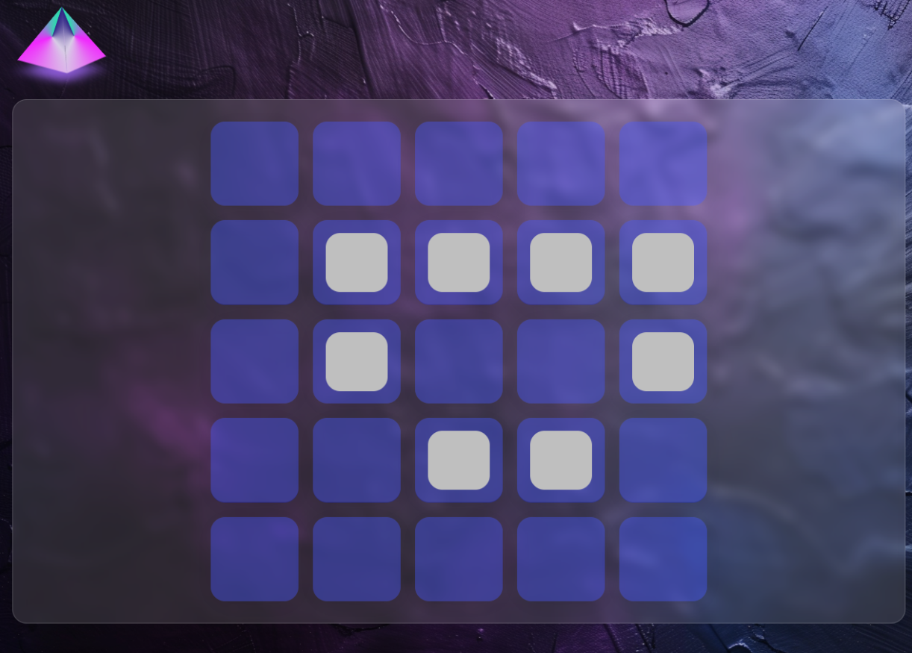
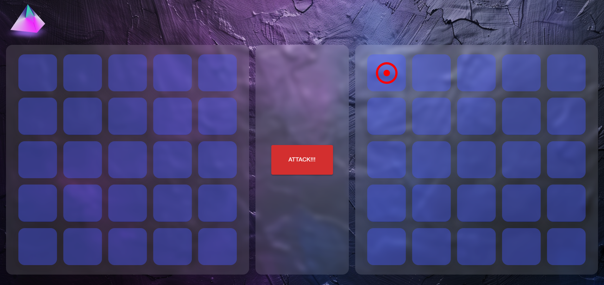

# Web3-battle-ship

This contract implements a Battleship game for two players. During game, players place their ships on a virtual board (represented by keccak256 hashes), take turns shooting at each other's ships, and report hits using cryptographic proofs. The game ends when one player destroys all the ships of the other player.

## Client:

**Placing Ships**

**Battle**

### Contract:
- Player Management:
    - Supports exactly two players.
    - Verifies player addresses during game interaction.
- Ship Placement:
    - Players submit keccak256 hashes representing their ship placements.
    - Duplicate ship placements on the board are prevented.
- Shot Validation:
    - Players use signatures to prove the validity of their shots.
    - The contract verifies the signatures using the Verify contract (assumed to be imported).
- Hit Detection:
    - The contract checks if a shot hits a ship based on the submitted hash.
- Game State Management:
    - Tracks destroyed ships and players.
    - Determines the winner when one player loses all ships.
    - Handles turn management and checks if all players have played/reported hits.

| State Variables | Description |
| ----------- | ----------- |
| owner | The address of the contract deployer |
| NO_PLAYERS | Constant defining the maximum number of players (2) |
| NO_SHIP_PIECES | Constant defining the number of ship pieces per player (10) |
| players | Mapping to track participating players (address to bool) |
| playersAddress | Array of player addresses for easier iteration. |
| ships | Mapping to store player ship placements (address to mapping of ship hash to bool) |
| destroyedShips | Mapping to store destroyed ship coordinates for each player (address to array of Coordinates) |
| destroyedPlayers | Mapping to track players who lost all ships (address to bool) |
| numberOfDestroyedPlayers | Keeps track of the number of players who lost |
| playerShots | Mapping to store the last shot coordinates for each player (address to Coordinate) |
| playerHasPlayed | Mapping to track if a player has made a shot in the current turn (address to bool) |
| playerHasPlacedShips | Mapping to track if a player has placed their ships (address to bool) |
| playerHasReportedHits | Mapping to track if a player has reported hits in the current turn (address to bool) |
| isGameOver | Boolean flag indicating if the game is over |

- Structs:
    - Coordinate: Represents a ship or shot location on the board (x, y coordinates).
    - ShipShotProof: Stores proof of a shot including the signature, and the address of the player who took the shot.

- Events:
    - ShotReport: Emitted when a shot is reported, including coordinates, target, shooter, and hit status.
- PlayerJoinedGame: 
    - Emitted when a player joins the game.
- PlayerLost: 
    - Emitted when a player loses all ships.
- Constructor:
    - Takes an array of player addresses as input.
    - Validates the number of players.
    - Adds players to the game and emits PlayerJoinedGame events.
    - Sets the contract owner.
- Functions:
`joinGame(_playerShips)`: Allows a player to join the game by submitting their ship placements as keccak256 hashes.
`takeAShot(_coord)`: Lets a player take a shot at a specific coordinate.
`reportHits(_shotSignatures)`: Allows a player to report hits on their opponent's ships using signed proofs.
`isHit(_hitProof)`: Internal function that verifies the shot proof and checks if it hits a ship.
`destroyPlayerShip(_player, _coord)`: Internal function that marks a ship as destroyed and checks for a winner.
`isTurnOver()`: Checks if all players have made their shots in the current turn.
`hasReportedShots()`: Checks if all players have reported hits in the current turn.
`endTurn()`: Ends the current turn, resets player variables, and